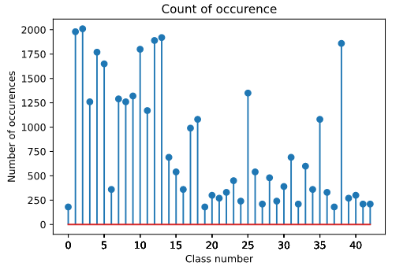
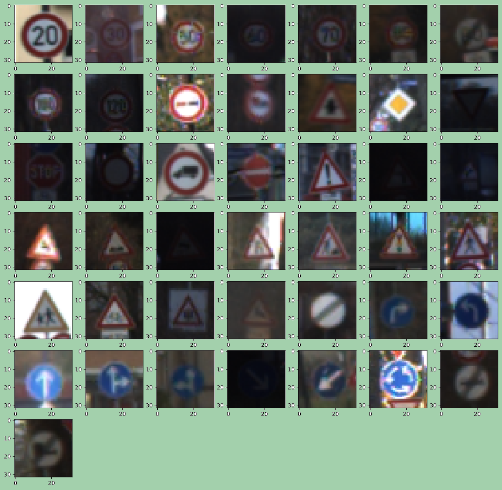
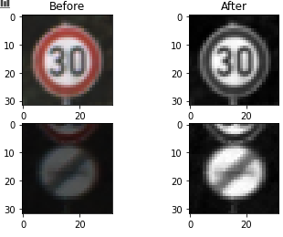
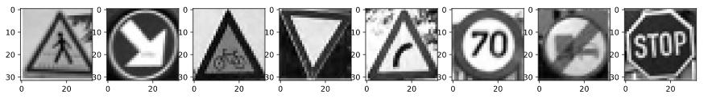
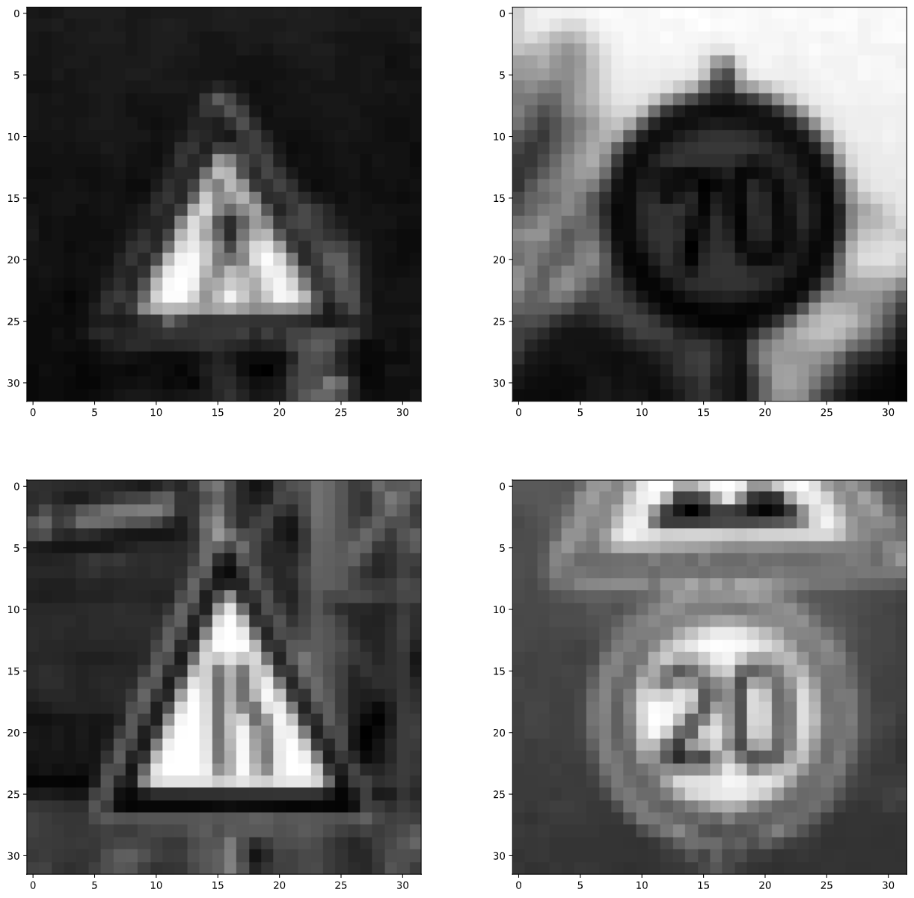

# **Traffic Sign Recognition**

## Writeup

**Build a Traffic Sign Recognition Project**

The goals / steps of this project are the following:
* Load the data set (see below for links to the project data set)
* Explore, summarize and visualize the data set
* Design, train and test a model architecture
* Use the model to make predictions on new images
* Analyze the softmax probabilities of the new images
* Summarize the results with a written report

#### 1. Provide a basic summary of the data set.

Summary statistics of the traffic signs data set:

* The size of training set is 34799
* The size of the validation set is 4410
* The size of test set is 12630
* The shape of a traffic sign image is 32 x 32 x 3
* The number of unique classes/labels in the data set is 43

#### 2. Include an exploratory visualization of the dataset.

To gain an overview of how test data looks like, I carried out three tests:
1. Counting the number of different classes in the set by finding unique values in the y_data
2. Calculating the number of occurences for each class, to analyze how balanced they are
3. Plotting the first traffic sign instance of each class

Result are:
1. There is 43 classes marked by numbers 0-42 (this was to be expected by looking signnames.csv)
2. Occurance plot:

3. Class examples:

### Design and Test a Model Architecture

#### 1. Describe how you preprocessed the image data. What techniques were chosen and why did you choose these techniques? Consider including images showing the output of each preprocessing technique. Pre-processing refers to techniques such as converting to grayscale, normalization, etc. (OPTIONAL: As described in the "Stand Out Suggestions" part of the rubric, if you generated additional data for training, describe why you decided to generate additional data, how you generated the data, and provide example images of the additional data. Then describe the characteristics of the augmented training set like number of images in the set, number of images for each class, etc.)

For preprocessing the data I decided to use two transformations, converting the images to grayscale and normalization.

Since traffic signs should be distinctive even without using the color information, grayscaling the images reduces amount of non essential data. Color data should not contain information that can't be extracted from graycale data in some way. This should allow NN to concentrate on features that are important and make it more robust when classifying inputs.

Here is an example of a traffic sign image before and after grayscaling:

Data normalization has several benefits:
1. Normalizes brightness levels accros images, removing the data we are not interested in (see grayscale example above)
2. Zero mean allows better numerical stability and faster convergance of the optimizer algorithm

#### 2. Describe what your final model architecture looks like including model type, layers, layer sizes, connectivity, etc.) Consider including a diagram and/or table describing the final model.

My final model consists of the following layers:

| Layer         		|     Description	        					|
|:---------------------:|:---------------------------------------------:|
| Input         		| 32x32x1 grayscale image   					|
| Convolution 5x5     	| 1x1 stride, same padding, outputs 32x32x8 	|
| RELU					|												|
| Max pooling	      	| 2x2 stride,  outputs 16x16x8                  |
| Convolution 5x5	    | 1x1 stride, valid padding, outputs 12x12x16   |
| RELU                  |                               |
| Max pooling           | 2x2 stride, outputs 6x6x16    |
| Flatten               | output 576                    |
| Fully connected		| input 576, output 120         |
| Dropout               | keep 50%                      |
| RELU                  |                               |
| Fully connected		| input 120, output 84          |
| RELU                  |                               |
| Fully connected		| input 84, output 43, logits   |

 
I used the LeNet architecture and modified it somewhat. Most significant change is adding the dropout phase. I experimented by changing the depth of convolution layers without much improvement, and increased the original depth from 6 to 8.

Dropout layer did wonders for the model. It stabilized the accuracy growth between epochs, and allowed greater ending accuracy to be obtained.

#### 3. Describe how you trained your model. The discussion can include the type of optimizer, the batch size, number of epochs and any hyperparameters such as learning rate.

The cost function used is standard 'softmax_cross_entropy_with_logits' for calculating back-propagation gradients. I used AdamOptimizer due to its advantages described in the materials.

BATCH_SIZE: increases the amount of samples introduced in each training step, but decreases the number of steps in the single epoch. The advantage here is that the optimizer has more data to robustly calculate gradients, but number of epoch should be increased to compensate for fewer training steps. I deduced that with greater batch sizes the rate should also be increased.

RATE: With greater learing rate we can faster converge tovards limiting accuracy, but having it too large we may miss more optimal solutions. On the other hand choosing too low rate can drastically increase learning time and even introduce numerical stability issues.

EPOCH: Estimated number of iterations through the whole dataset to reach desired accuracy. In practice it shows it is simple to define number of epoch if the accuracy improves steadily during training. I used condition (validation_accuracy > 0.96) to stop training once the condition was satisfied.

Values of the hyperparameters:
EPOCHS = 30
BATCH_SIZE = 512
rate = 0.003

#### 4. Describe the approach taken for finding a solution and getting the validation set accuracy to be at least 0.93. Include in the discussion the results on the training, validation and test sets and where in the code these were calculated. Your approach may have been an iterative process, in which case, outline the steps you took to get to the final solution and why you chose those steps. Perhaps your solution involved an already well known implementation or architecture. In this case, discuss why you think the architecture is suitable for the current problem.

My final model results were:
* training set accuracy of 0.994
* validation set accuracy of 0.960 (after 17 epochs)
* test set accuracy of 0.940

I used LeNet architecture as my base model, and made some modification afterwards.

LeNet architecture seemed as a good choice, since there are many similarities between recognition of letters and traffic signs. Both of these are symbols where each has a set of recognizable features/shapes. The similarity is even greater if we use grayscaled images of traffic signs, discarding color information.

One of the problems with the model was that the validation accuracy was varying significantly during the training. This was solved by introducing "dropout" layer, which improved convergence stability during the training.

I did made some other adjustments such as using "SAME" instead "VALID" padding so that first convolution layer does not trim the input images. Input images for LeNet example were also not trimmed since the images were previously padded with zero pixels.

Since training data is very unbalanced (number of class representatives varies wildly), I used random picking technique where each class has equal chance to be chosen. By my estimate this reduced the chance of model overfitting for particular classes. The data for the LeNet example model was much more balanced, so this was good indication balancing the data would be useful.

### Test a Model on New Images

#### 1. Choose five German traffic signs found on the web and provide them in the report. For each image, discuss what quality or qualities might be difficult to classify.

Here are five German traffic signs that I found on the web:

I planned to have a batch of signs were each one has similar shape/symbol relation, as the examples in the training/validation set, to have a realistic chance that model would correctly recognize them. Also, chosen signs represent a good cross section of different symbols and shapes.

One of the signs, 'Keep right', has the arrow symbol wider than most of those present in the test data. This way I wanted to check how good the model can generalize from atypical data.

#### 2. Discuss the model's predictions on these new traffic signs and compare the results to predicting on the test set. At a minimum, discuss what the predictions were, the accuracy on these new predictions, and compare the accuracy to the accuracy on the test set (OPTIONAL: Discuss the results in more detail as described in the "Stand Out Suggestions" part of the rubric).

Here are the results of the prediction:

| Image			        |     Prediction	        					|
|:---------------------:|:---------------------------------------------:|
| Pedestrians      		    | Road narrows on the right |
| Keep right       	        | Keep right                |
| Bycicle crossing   	    | Bycicle crossing			|
| Yield 	      		    | Yield      				|
| Dangerous curve right	    | Dangerous curve right     |
| Speed limit 70	        | Speed limit 20            |
| End of no pass 3.5t       | End of no pass 3.5t       |
| Stop                      | Stop                      |

The model was able to correctly predict 6 of the 8 traffic signs, which gives an accuracy of 75%. This is lower than the test accuracy of 94%, but of course the data set should be much larger for better comparison. The style of the web traffic signs does seem somewhat different than one used during the training and validation.

#### 3. Describe how certain the model is when predicting on each of the five new images by looking at the softmax probabilities for each prediction. Provide the top 5 softmax probabilities for each image along with the sign type of each probability. (OPTIONAL: as described in the "Stand Out Suggestions" part of the rubric, visualizations can also be provided such as bar charts)

Here are the top 5 softmax probabilities for each of the predictions:

| Probability         	|     Prediction	        					|
|:---------------------:|:---------------------------------------------:|
| .96         			| 24    Road narrows on the right               |
| .02     				| 21    Double curve 							|
| .01					| 27    Pedestrians								|
| < .01	      			| 11	Right-of-way at the next intersection	|
| < .01				    | 30    Beware of ice/snow     					|
Correct: 27	Pedestrians
 

| Probability         	|     Prediction	        					|
|:---------------------:|:---------------------------------------------:|
| .93         			| 38    Keep right							    |
| .04     				| 13    Yield 									|
| .01					| 3	   	Speed limit 60							|
| < .01	      			| 36    Go straight or right					|
| < .01				    | 25    Traffic signals     					|
Correct: 38    Keep right
 

| Probability         	|     Prediction	        					|
|:---------------------:|:---------------------------------------------:|
| .70         			| 29    Bicycles crossing						|
| .25     				| 22    Bumpy road 								|
| .04					| 28    Chilren crossing						|
| < .01	      			| 24    Road narrows on the right				|
| < .01				    | 30    Beware of ice/snow   					|
Correct: 29    Bicycles crossing
 

| Probability         	|     Prediction	        					|
|:---------------------:|:---------------------------------------------:|
| .99         			| 13	Yield                                   |
| < .01    			    | 35	Ahead only                              |
| < .01				    | 12	Priority road                           |
| < .01	      		    | 25	Road work                               |
| < .01				    | 15	No vehicles                             |
Correct: 13	Yield
 

| Probability         	|     Prediction	        					|
|:---------------------:|:---------------------------------------------:|
| .99         			| 20	Dangerous curve to the right            |
| < .01    			    | 11	Right-of-way at the next intersection   |
| < .01				    | 28	Children crossing                       |
| < .01      			| 27	Pedestrians                             |
| < .01				    | 30	Beware of ice/snow                      |
Correct: 20	Dangerous curve to the right
 

| Probability         	|     Prediction	        					|
|:---------------------:|:---------------------------------------------:|
| .87         			| 0	Speed limit (20km/h)                        |
| .08     				| 4	Speed limit (70km/h)                        |
| .03					| 1	Speed limit (30km/h)                        |
| < .01	      			| 33	Turn right ahead                        |
| < .01				    | 3	Speed limit (60km/h)                        |
Correct: 4	Speed limit (70km/h)
 

| Probability         	|     Prediction	        					|
|:---------------------:|:---------------------------------------------:|
| .99         			| 42	End of no passing by vehicles over 3.5 metric tons |
| < .01     			| 6	End of speed limit (80km/h)                 |
| < .01					| 41	End of no passing                       |
| < .01	      			| 12	Priority road                           |
| < .01				    | 16	Vehicles over 3.5 metric tons prohibited|
Correct: 42	End of no passing by vehicles over 3.5 metric tons
 

| Probability         	|     Prediction	        					|
|:---------------------:|:---------------------------------------------:|
| .98         			| 14	Stop                                    |
| .01     				| 3	    Speed limit (60km/h)                    |
| < .01					| 13	Yield                                   |
| < .01	      			| 5	    Speed limit (80km/h)                    |
| < .01				    | 1	    Speed limit (30km/h)                    |
Correct: 14	Stop

Here is the comparison for the traffic signs that were incorectly classified (lower), with the typical correct examples from the training data (upper):

Overall, I think the classication has performed well, and the incorrectly classified signs still bear significant similarities with the correct predictions.
